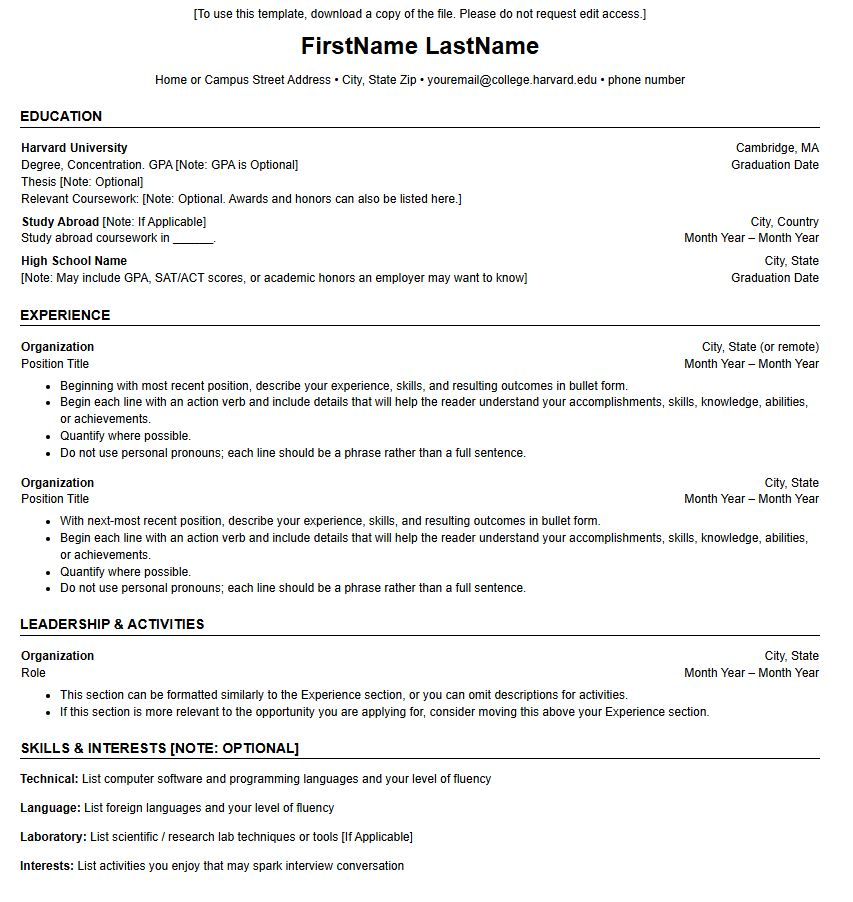

# Frontend Technical Specification

- Create a static website that serves an HTML resume.


## Resume Format Considerations

I'm going to use [Harvard Resume Template format](https://careerservices.fas.harvard.edu/resources/bullet-point-resume-template/) as the basis of my resume. I'm in EU, and basically I used similar format for years now, never had any complaints.


### Harvard Resume Format Generation

I know basic HTML and CSS, but I'll let our friend ChatGPT do the heavy lifting and generate both HTML/CSS code and from there I'll modify it as needed.

Prompt to ChatGPT 5:
```text
Convert this resume format into HTML.
Please don't use a CSS framework.
Please use the least amount of CSS tags.
```

Image provided to LLM:


This is the [generated output](./docs/24-11-2025-resume-minimal.html) which I will tweak accordingly.

This is what the generated HTML page looks like unaltered:


## HTML adjustments
- UTF8 because it supports most known languages
- We will be applying mobile styling to our website so we'll include viewport meta tag width=device-width
- We'll extract styles into its own stylesheet once we're happy with our HTML markup
- We'll use indentation (tab - 4 spaces)

## Serve Static Website Locally

Assuming we have node install we'll use the simple web-server http-server

### Install HTTP server
```sh
npm i http-server -g
```

### Serve Website
http-server will serve a public folder by default where the command is run

```sh
cd frontend
http-server
```

### Background image
Used AI to generate an image, due to larger size of initial PNG image in png format, we've resized it and saved it as jpeg (lowering the size by ~90%)  

### Frontend Framework Consideration

- Using React because that's how Andrew's doing it - also it's the most popular javascript framework.
- Using Vite.js over webpack because our frontend is very simple.
- Configured React Router V7, used declarative mode due to app being very simple